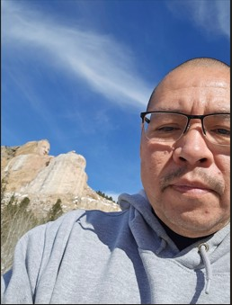

# Jason Slick

  
## About Me  

My name is Jason Slick, I am a San Carlos Apache from San Carlos, Arizona. I currently reside in Maricopa, Arizona with my wife and three teenage boys. I work at [Stahl's Transfer Express](https://www.transferexpress.com/) as a Production Technican. We make t-shirts transfer for all occasions

## Education
I started my college journey in 2020 with zero computer knowledge, and after four years, I graduated with an Associate of Applied Science degree in Computer Information Technology from [Colorado Christian University](https://www.ccu.edu/) in Lakewood, Colorado, which I got last May. However, I felt that I needed to learn more, so I went back to school at a San Carlos Apache College which I am pursuing an Associate of Applied Science in Computer Information Systems as an online student. I am taking a Intro to GIS class and was made aware of this opportunity from my instuctor and I am excited to learn what this field has to offer. I went to Rapid City, South Dakota in March for AIHEC (Ameircan Indian Higher Education Consortium) 2025 and I placed 3rd in the individual Web Page Design competition, which makes me feel more confident in what I can accomplish. I did some Intro to Python courses at CCU so hopefully it will come back to me as I go. I had also tried my hand in Culinary at one point in my journey whichI was not able to finish.

## Contact Information
+ Email: <jason.slick@tocc.edu>
+ [LinkedIn](http://www.linkedin.com/in/jason-slick-2449441a3)
+ [GitHub](https://github.com/jslick1291/jslick1291.github.io/edit/main/index.md#jason-slick)
